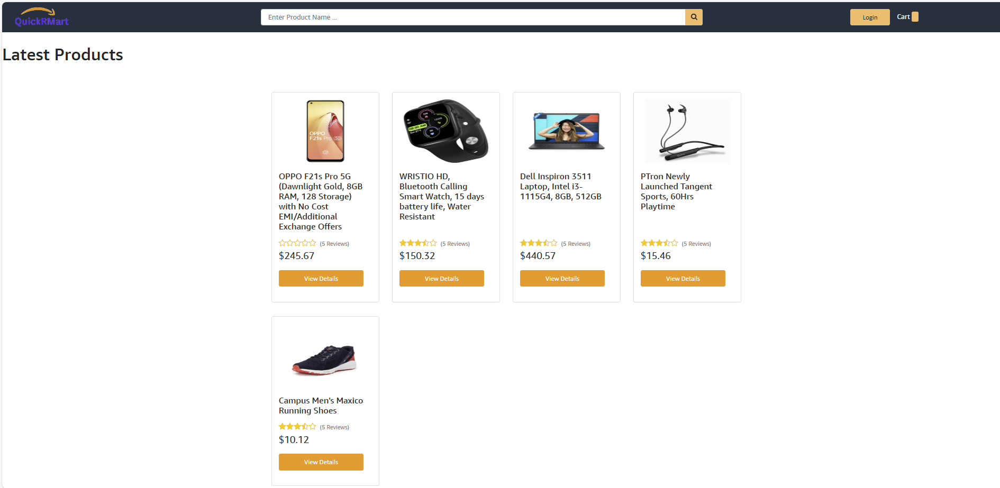

# Quick R Mart

an E-commerce Website built with MERN stack.

## Instructions

after cloning, run this command in the root folder
```bash
npm install
```
navigate to "frontend" folder, run these commands 
```bash
npm install
npm run build
```
wait for application build
after that open the backend/config/config.env
and update the MongoDB connection string
```bash
...
DB_LOCAL_URI=mongodb://localhost:27017/QuickRMart
```

navigate back to "root" folder and run this command for loading demo data
```bash
npm run seeder
```

run this below command to run the app in production mode
```bash
npm run prod
```


## Test
open the http://localhost:8000 and test the 

## Postman Collection
https://ragubytes.postman.co/workspace/RaguBytes-Workspace~78053eae-1561-443a-a4ca-420dae1fa51a/collection/10307271-df6fab46-0173-4111-8350-741443e3359a?action=share&creator=10307271&active-environment=10307271-4392efb0-6f78-42e1-bdae-2b452fed574a

## Home Page


## License

[MIT](https://choosealicense.com/licenses/mit/)
